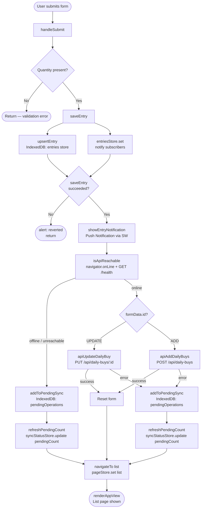
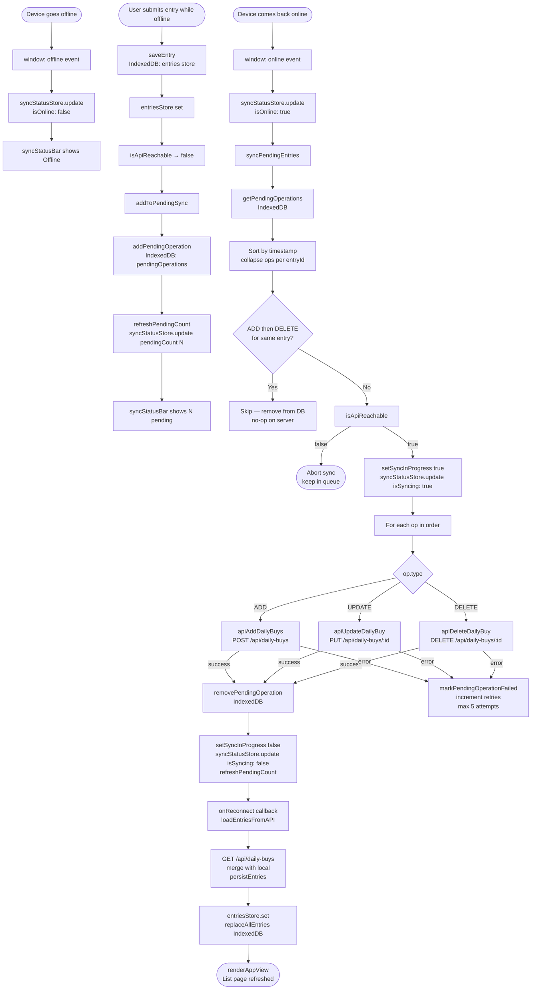
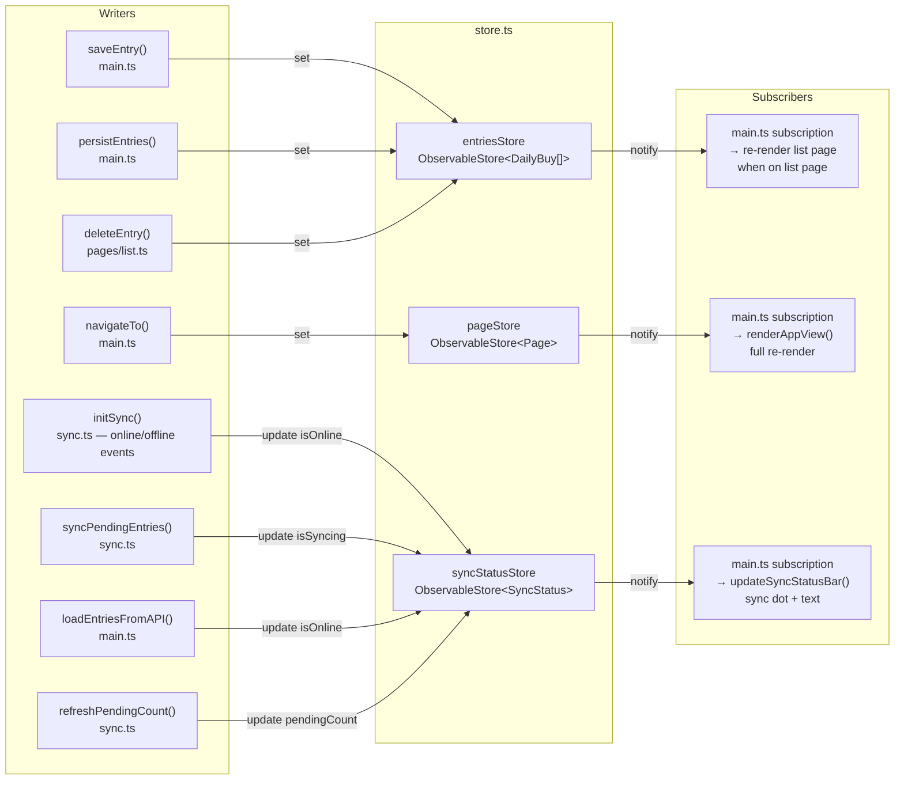

# IPS Grow — UI

Offline-first PWA built with Vite + TypeScript. Entries are always written to IndexedDB first, then synced to the API when online.

---

## Architecture Overview

| File | Responsibility |
|---|---|
| `main.ts` | App bootstrap, form handling, event wiring |
| `store.ts` | Reactive state (`ObservableStore`) |
| `db.ts` | IndexedDB access (entries + pending operations) |
| `sync.ts` | Pending queue management, sync-on-reconnect |
| `api.ts` | HTTP client for `localhost:3000/api` |
| `offline.ts` | `online`/`offline` event listeners + toast |
| `ui.ts` | Pure render functions (no side effects) |
| `pages/list.ts` | List page renders + delete logic (lazy loaded) |
| `public/sw.js` | Service worker — caching, notification click |

---

## Online Mode — Entry Submit Flow



---

## Offline Mode — Reconnection & Sync Flow



---

## ObservableStore — Data Flow



### ObservableStore API

```
store.get()               → returns current value (synchronous)
store.set(value)          → sets value, notifies all subscribers (skips if same ref)
store.update(fn)          → store.set(fn(current))
store.subscribe(listener) → calls listener immediately + on every change
                            returns unsubscribe function
```

### SyncStatus shape

```ts
{
  isOnline: boolean      // true = API reachable
  isSyncing: boolean     // true = syncPendingEntries in progress
  pendingCount: number   // ops waiting in IndexedDB pendingOperations store
}
```

### syncStatusBar display logic

| `isSyncing` | `isOnline` | `pendingCount` | Display |
|---|---|---|---|
| true | any | any | `Syncing...` |
| false | true | 0 | `Online` |
| false | true | > 0 | `N pending` |
| false | false | any | `Offline` |

---

## IndexedDB Schema

**Database:** `DailyBuyTrackerDB` (version 2)

| Object Store | Key | Purpose |
|---|---|---|
| `entries` | `id` | Persisted local copy of all entries |
| `pendingOperations` | `id` (UUID) | Queue of ADD / UPDATE / DELETE ops not yet synced to API |

### PendingOperation shape

```ts
{
  id: string          // operation UUID
  entryId: string     // DailyBuy.id this op targets
  type: "ADD" | "UPDATE" | "DELETE"
  data: DailyBuy      // payload (omitted for DELETE)
  timestamp: string   // ISO — used for chronological ordering
  retries: number     // incremented on each failure (max 5)
  lastError?: string  // last error message
}
```

### Collapse rules (applied before sync)

| History for an entryId | Collapsed to |
|---|---|
| ADD → UPDATE | ADD (with latest data) |
| ADD → DELETE | skipped entirely — no API call needed |
| UPDATE → DELETE | DELETE |
| UPDATE → UPDATE | UPDATE (latest data wins) |
